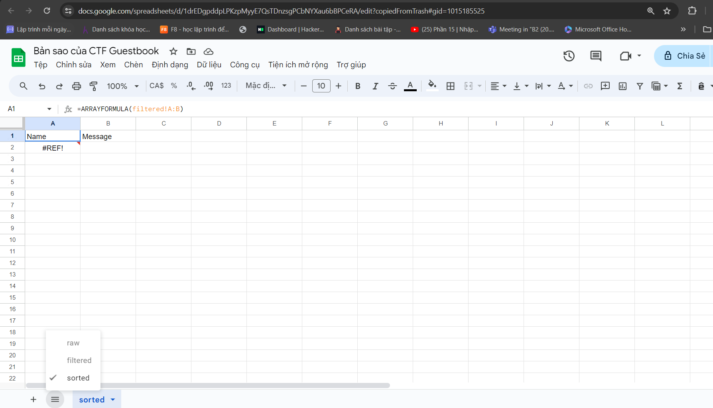
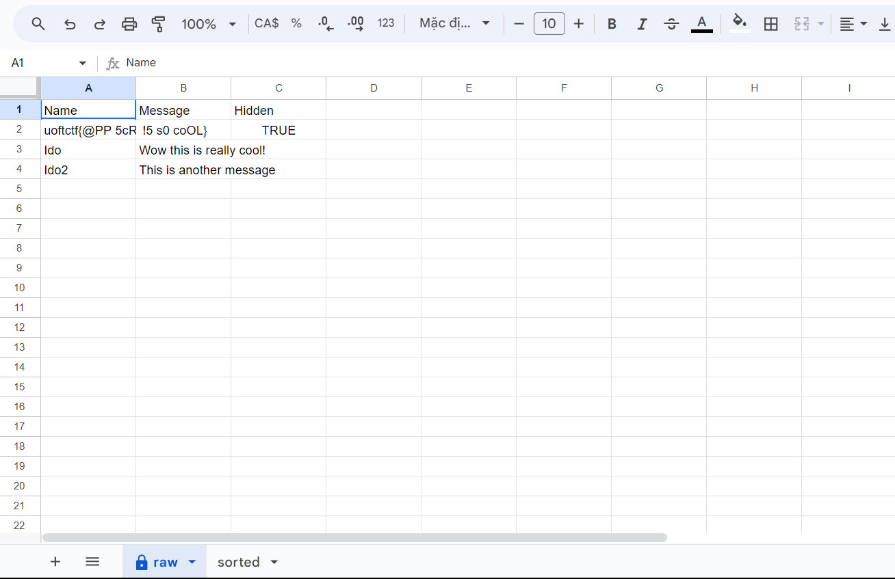
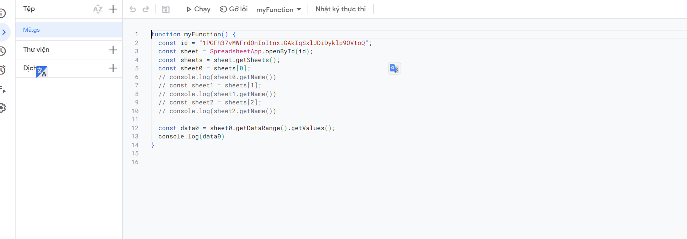
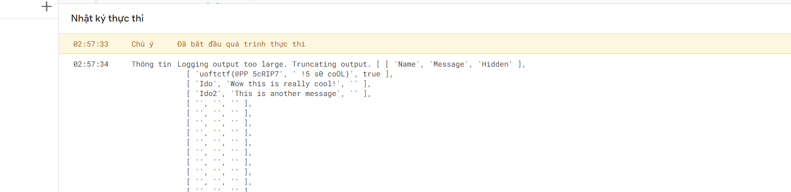

Đây là source code của bài này

<!DOCTYPE html>
<html lang="en">
<head>
    <meta charset="UTF-8">
    <title>My Guestbook</title>
    
</head>
<body>
<h1>
    Hi! I made this guestbook for my site, please sign it.
</h1>
<iframe name="dummyframe" id="dummyframe" style="display: none;"></iframe>
<h3 style="margin: 0">Last 10 user entries in the guestbook:</h3>

Loading...

<ul id="entries" style="margin: 0">
</ul>

<h3>Sign the guestbook:</h3>
<form method="POST" action="https://script.google.com/macros/s/AKfycbyMdMLPsRtvXmcQN1V2yR3Zv_HYI1jvVqOCNAZpx7xgXqSflgwrtcveyUaGB8eTZwkM/exec?sheetId=1PGFh37vMWFrdOnIoItnxiGAkIqSxlJDiDyklp9OVtoQ">
  <input id="name" name="name" type="text" placeholder="Name" required>
  <input id="message" name="message" type="text" placeholder="Message" required>
  <button type="submit">Send</button>
</form>
</body>
</html>

Nó sẽ gọi một file data theo như mình tìm hiểu thì đây là một file sheet và đoạn 
                                        exec?sheetId=1PGFh37vMWFrdOnIoItnxiGAkIqSxlJDiDyklp9OVtoQ
Sẽ là một id riêng biệt cho một sheet
Để xem được nó thì có 2 cách 
+ cách 1:
 https://docs.google.com/spreadsheets/d/1PGFh37vMWFrdOnIoItnxiGAkIqSxlJDiDyklp9OVtoQ 
sẽ mở một sheet lên và nó chứa flag trong module raw

+ cách 2:
Dùng app script của google hoặc cũng có thể dùng js cũng được

Chạy code và nhận flag:

Flag: uoftctf{@PP 5cRIP7 !5 s0 coOL}