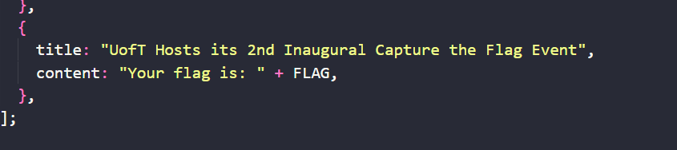
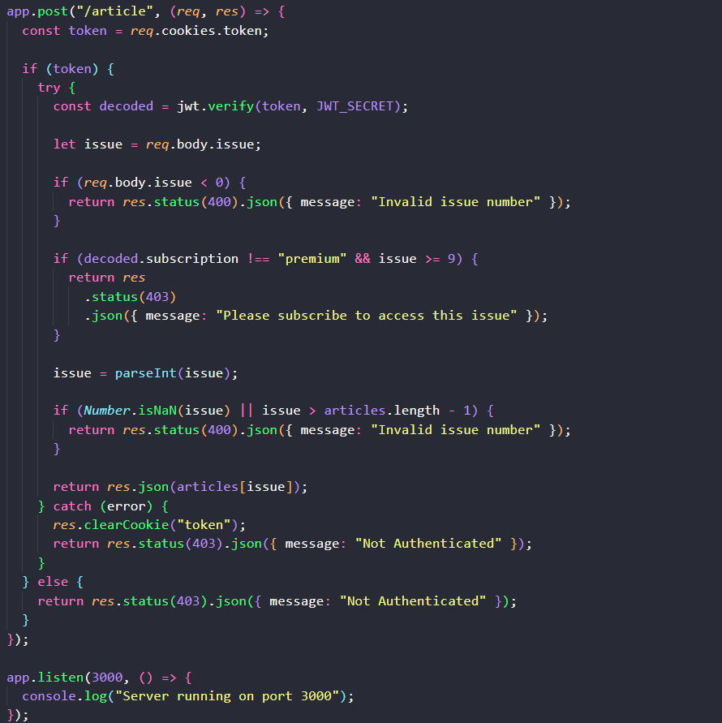
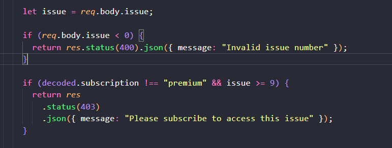
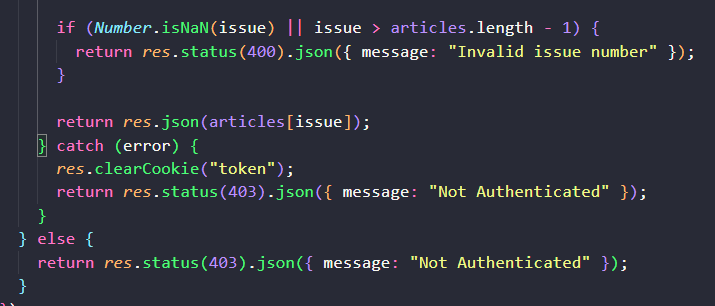
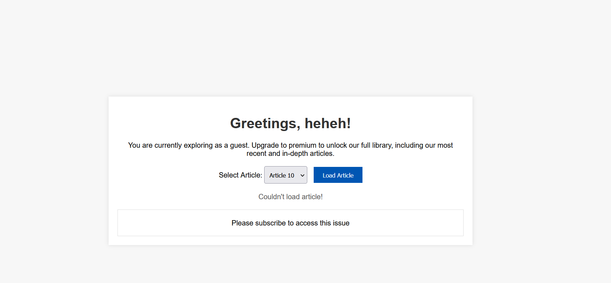
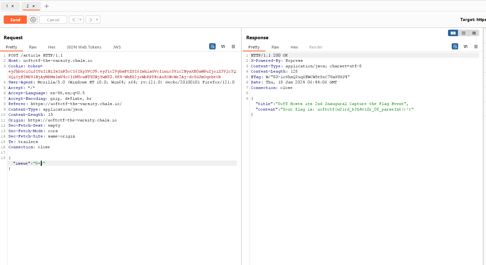
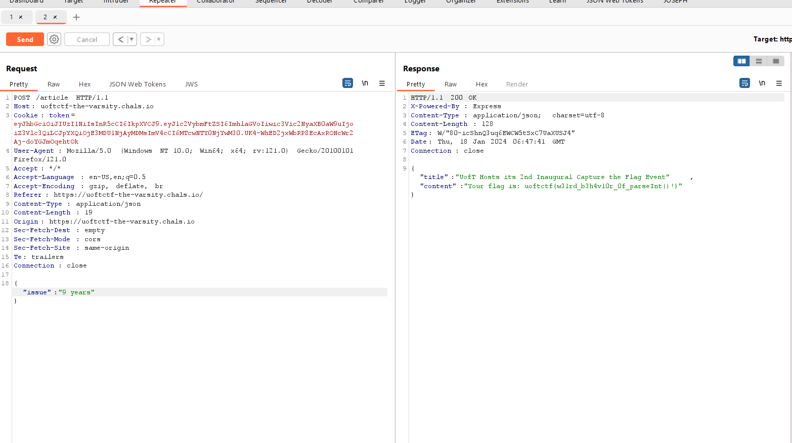

đề bài : The Varsity
vul : parseInt vul in javascript

View source have main you can get the flag

You must show item 10 to view it
Main function

Firstly, verify token

Firewall 1:

Get issue from your from and check issue must > 0
Check if subscription !== "subscription" && issue > 9
You understand if all condition are true and subscription !== "subscription" you cant't control it so you can control issue
After that, parseInt(issue)

Verify issue is number or issue > articles.length - 1
Solution 1: 

+ You can search parseInt in google to understand it
+If you control issue = "9+5"; issue > 9 and parseInt(issue) is Number
And so we get flag : : uoftctf{w31rd_b3h4v10r_0f_parseInt()!}

+If you control issue = "9 years"; issue > 9 and parseInt(issue) is Number

parseInt("10"); => 10
parseInt("10.00"); => 10
parseInt("10.33"); => 10
parseInt("34 45 66"); => 34
parseInt(" 60 "); => 60
parseInt("40 years"); => 40
parseInt("He was 40"); => NaN